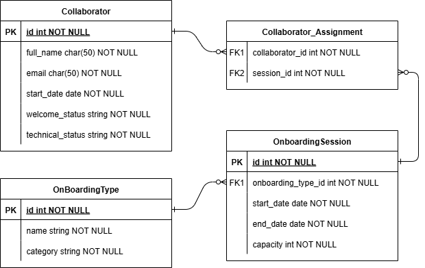

# App de Gestión de Onboarding - Solución al Reto Fullstack

## Descripción General

Esta aplicación web fue desarrollada como solución al **Reto Fullstack Junior – App de Gestión de Onboarding**. El objetivo principal es proporcionar una herramienta interna para gestionar el proceso de incorporación de nuevos colaboradores al banco, permitiendo un seguimiento detallado de los onboardings de bienvenida y técnicos, y administrando el calendario anual de sesiones de capacitación.

La solución ha sido implementada siguiendo las mejores prácticas de la industria, con una arquitectura robusta y escalable, y un diseño de interfaz alineado con la identidad visual del Banco de Bogotá.

---

## 📜 Tabla de Contenidos

1.  [Funcionalidades Implementadas](#-funcionalidades-implementadas)
2.  [Arquitectura de la Solución](#-arquitectura-de-la-solución)
    - [Diseño de la Base de Datos (Modelo E-R)](#-diseño-de-la-base-de-datos-modelo-e-r)
    - [Backend (Spring Boot)](#-backend-spring-boot)
    - [Frontend (Angular)](#-frontend-angular)
3.  [Stack Tecnológico](#-stack-tecnológico)
4.  [Instalación y Ejecución](#-instalación-y-ejecución)
    - [Prerrequisitos](#prerrequisitos)
    - [Configuración del Backend](#configuración-del-backend)
    - [Configuración del Frontend](#configuración-del-frontend)
5.  [Demostración de Funcionalidades](#-demostración-de-funcionalidades)
6.  [Consideraciones de Seguridad](#-consideraciones-de-seguridad)

---

## ✨ Funcionalidades Implementadas

-   **Gestión Completa de Colaboradores (CRUD):**
    -   Dashboard centralizado para visualizar a todos los colaboradores.
    -   Creación, actualización y eliminación de perfiles de colaboradores.
    -   Selección interactiva de filas en la tabla para habilitar acciones.
-   **Seguimiento de Onboardings:**
    -   Asignación de sesiones de onboarding (General y Técnico) a través de un formulario.
    -   Actualización en tiempo real del estado de los onboardings (`Pendiente`, `Completado`) directamente desde el dashboard.
    -   Lógica de negocio que impide cambiar el estado de un onboarding si no ha sido asignado.
-   **Filtros Dinámicos:**
    -   Capacidad para filtrar la lista de colaboradores por el estado de su onboarding general o técnico.
-   **Calendario de Sesiones:**
    -   Vista de calendario interactiva (implementada con **FullCalendar**) que muestra todas las sesiones programadas.
    -   Formulario dedicado para la creación de nuevas sesiones de onboarding, con lógica para calcular fechas de finalización excluyendo fines de semana.
    -   Actualización automática del calendario al crear una nueva sesión, sin necesidad de recargar la página.
-   **Sistema de Alertas Automatizado (Simulación):**
    -   Tarea programada en el backend que se ejecuta diariamente para verificar las sesiones que comienzan en 7 días.
    -   Simulación del envío de correos de recordatorio a los colaboradores inscritos, visible en la consola del servidor.

---

## 🏗️ Arquitectura de la Solución

La aplicación se construyó siguiendo un enfoque moderno y desacoplado, separando claramente las responsabilidades del backend y del frontend.

### 📊 Diseño de la Base de Datos (Modelo E-R)

El primer paso fue diseñar un modelo de datos relacional y normalizado para asegurar la integridad y eficiencia de la información.

**Diagrama Entidad-Relación (ERD):**

**Descripción de las Tablas:**
-   **`Collaborator`**: Almacena los datos personales de cada empleado.
-   **`OnboardingType`**: Define las plantillas de los onboardings disponibles (ej: "General", "Cap Devops").
-   **`OnboardingSession`**: Representa una instancia programada de un `OnboardingType`, con fechas y capacidad.
-   **`Collaborator_Assignment`**: Tabla de unión que gestiona la relación muchos-a-muchos entre colaboradores y sesiones.

### ☕ Backend (Spring Boot)

El backend se desarrolló con Spring Boot, siguiendo una **arquitectura en capas** para una clara separación de responsabilidades.

-   **Capa de Controlador (`@RestController`):** Expone los endpoints de la API RESTful. Es la única capa que maneja peticiones y respuestas HTTP.
-   **Capa de Servicio (`@Service`):** Contiene toda la lógica de negocio. Orquesta las operaciones y se comunica con los repositorios. Aquí se implementó la lógica para enriquecer los datos con DTOs.
-   **Capa de Repositorio (`@Repository`):** Abstrae el acceso a la base de datos utilizando **Spring Data JPA**. Define las interfaces para las operaciones CRUD.
-   **Entidades (`@Entity`):** Clases Java que mapean las tablas de la base de datos, utilizando **JPA y Hibernate** como ORM.
-   **DTOs (Data Transfer Objects):** Se utilizaron para modelar las respuestas de la API, permitiendo enviar al frontend objetos con la estructura exacta que necesita, sin exponer las entidades internas y enriqueciendo los datos cuando fue necesario (ej: añadiendo los IDs de sesión a los detalles del colaborador).
-   **Alertas Automatizadas (`@Scheduled`):** Se implementó un servicio con una tarea programada que se ejecuta diariamente para verificar el calendario y simular el envío de alertas, demostrando la capacidad del backend para realizar tareas en segundo plano.

### 🎨 Frontend (Angular)

El frontend se construyó con Angular, utilizando una arquitectura moderna de **componentes `standalone`** y una estructura de carpetas organizada por funcionalidades (`features`).

-   **Estructura de Carpetas:**
    -   `features/`: Contiene los módulos de negocio principales (colaboradores, sesiones).
    -   `services/`: Logica de negocio que se comunica con el backend.
    -   `models/`: Define las interfaces de TypeScript para un tipado fuerte.
-   **Diseño y Estilos:**
    -   Se implementó la **paleta de colores y la tipografía corporativa** del Banco de Bogotá a través de variables globales en `styles.scss`, asegurando una consistencia visual total.
    -   Se utilizó **Bootstrap** como framework base para el layout y componentes básicos.
-   **Componentes Clave:**
    -   **`CollaboratorsDashboard`**: Muestra la tabla de colaboradores con funcionalidades de selección, filtrado y acciones CRUD.
    -   **`CollaboratorForm`**: Formulario dinámico para crear y editar colaboradores, con lógica para manejar la asignación de sesiones.
    -   **`OnboardingCalendar`**: Implementado con **FullCalendar**, muestra visualmente las sesiones de onboarding.
    -   **`OnboardingForm`**: Formulario para crear nuevas sesiones, con lógica de negocio para el cálculo de fechas.
-   **Comunicación entre Componentes:** Se utilizaron servicios de Angular (`CollaboratorDataService`, `CalendarUpdateService`) para comunicar eventos entre componentes no relacionados directamente, como la actualización del calendario después de crear una sesión en el formulario.

## 💻 Stack Tecnológico

-   **Base de Datos:** MySQL
-   **Backend:**
    -   Java 17+
    -   Spring Boot 3
    -   Spring Data JPA / Hibernate
    -   Maven
-   **Frontend:**
    -   Angular 20 
    -   TypeScript
    -   Bootstrap 5
    -   FullCalendar
    -   SCSS
-   **Herramientas:**
    -   Git
    -   Postman / cURL (para pruebas de API)
    -   IntelliJ IDEA / VS Code

## 🚀 Instalación y Ejecución

### Prerrequisitos

-   Tener instalado Java (JDK 17 o superior).
-   Tener instalado Node.js y npm.
-   Tener instalado el Angular CLI (`npm install -g @angular/cli`).
-   Tener una instancia de MySQL corriendo.

### Configuración del Backend

1.  Clonar el repositorio.
2.  Abrir el proyecto backend (Carpeta: `collaboratorsmanagement`) en tu IDE preferido.
3.  Crear una base de datos en MySQL llamada `collaborators_management`.
4.  Configurar las credenciales de la base de datos en el archivo `src/main/resources/application.properties`.
5.  Ejecutar la aplicación. Spring Boot creará las tablas automáticamente gracias a la configuración de Hibernate.
6.  Opcional: Ejecutar los scripts SQL proporcionados para poblar la base de datos con datos de prueba iniciales.

### Configuración del Frontend

1.  Navegar a la carpeta del proyecto frontend en una terminal (Carpeta: `front_collaborators_management_app`).
2.  Instalar las dependencias: `npm install`
3.  Ejecutar la aplicación: `ng serve -o`
4.  La aplicación se abrirá automáticamente en `http://localhost:4200`.

## 🎬 Demostración de Funcionalidades

-   **Dashboard de Colaboradores:** Al iniciar, la aplicación muestra la tabla con todos los colaboradores. Se puede hacer clic en una fila para seleccionarla y habilitar los botones de "Actualizar" y "Eliminar".
-   **Crear Colaborador:** Al hacer clic en "Crear", se navega al formulario. Al completarlo y asignarle sesiones, se crean tanto el colaborador como las relaciones en la base de datos.
-   **Actualizar Colaborador:** Al seleccionar una fila y hacer clic en "Actualizar", se navega al formulario con los datos precargados. Se puede cambiar la asignación de sesiones, y el sistema se encargará de eliminar las relaciones antiguas y crear las nuevas.
-   **Crear Sesión:** En la vista de "OnBoarding Sessions", se puede crear una nueva sesión. Al completarse, el calendario se actualiza automáticamente para mostrar el nuevo evento.
-   **Alertas:** Para verificar esta funcionalidad, se debe tener el backend corriendo y revisar la consola del servidor a la hora definida en la expresión `cron` en `AlertService.java` para pruebas.

## 🔒 Consideraciones de Seguridad

-   El proyecto se desarrolló en un **repositorio personal de GitHub**, sin ninguna vinculación a los repositorios del banco.
-   **No se subieron credenciales**, claves de API o cualquier otra información sensible al repositorio.
-   Se utilizó un archivo `.gitignore` para excluir archivos de configuración local y dependencias.
-   En el backend, se configuró **CORS** (`@CrossOrigin`) para permitir peticiones únicamente desde el origen del frontend (`http://localhost:4200`), previniendo el acceso desde otros dominios.

---

**Autor:** Carlos Collazos
